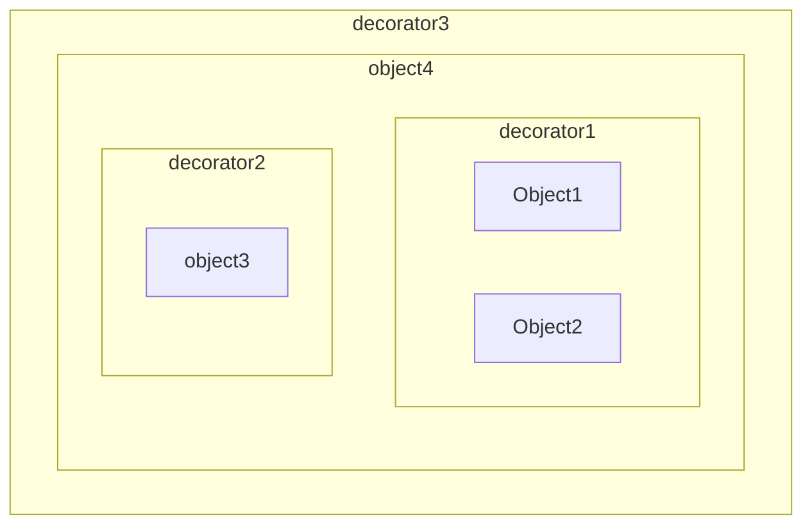
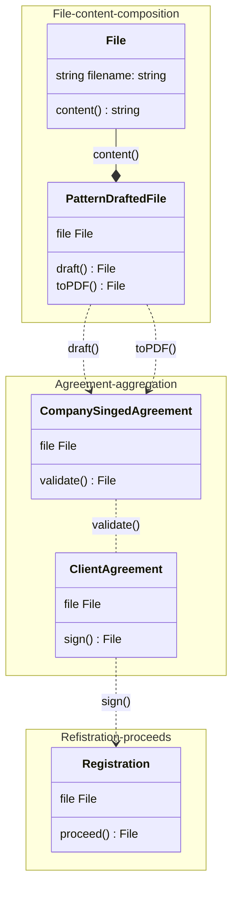

# **Decorators and composition**
<span class='translation_button'>[Read in RUS (translated by ChatGPT)](/Programming/Decorators-rus)</span>

<link href="/stylesheets/tags.css" rel="stylesheet" type="text/css"/>
<div class="tags">
    <div class='tag'>
        <a href="/tags#Programming">Programming</a>
    </div>
    <div class='tag'>
        <a href="/tags#Typescript">Typescript</a>
    </div>
    <div class='tag'>
        <a href="/tags#OOP">OOP</a>
    </div>
</div>
*23.09.2023* | *6-7 min. reading*  
*Further examples are in typescript, compiled and ran with ts-node*

---
## Introduction

According to [wikipedia](https://en.wikipedia.org/wiki/Decorator_pattern)  the decorator pattern is some sort of an object wrapper around original (target) object, that expands somehow its **behavior**. In programming its the most widely, i believe, and frequently used design pattern, in OOP specifically.

**Important note**   
A decorator should always implement the original interface and be treated as the original decoratee (what is decorated) to the client usgin it. So the can not be no extra methods, behavior or overriding existent.

## Details

Lets make a claim, why its good and what are the benefits:

It follows the essential principle in true OOP - combine (wrap) smaller objects in a bigger one. And since the object has to hide data and expose behavior, a decorator **encapsulates that behavior** and adds some more to it, which wasn't the responsibility of original object on first place.

It saves you control over it.  
    When an object is decorated, and if it's small and easy to understand, the composition with decorator, when wrapping, lets for programmer easy control behavior addition (see this article). Practically it means, when you write a decorator to an object it still is your code and your object, you keep control over it.
  
It gives you great tool for specifying **distribution by purpose**. For example, if you have a *File* object, when decorating it for different use-cases it maybe:  

- *CachedFile* - original file is decorated with cache layer, that allow reading the file for the first time and after gives you a cached content, until file's content is changed.
- *LicensedFile* - for example, when you read a file made changes to it or want to add only the license for contributing then it to somewhere, you may create a decorator to write a license over and use it when needed.
- *GrammarCheckedFile* - if you do, for example, grammar checking for a file that contains some human language and want to pass it somewhere further you can expand the behavior of original file by grammar checking decorator, which would return an original file and a report of checking with errors, warnings.

That being said, we represent our object model like this:


So when the composition takes a place, and as we know, it's the best solution for creating a clean OO architecture, easy to maintain, test, fix, extend, modify.

---
## In action

Lets take a quick look on programming.
We have a *sample.txt* file with following content:
```
This is some content
```
And we've wrote a *File.ts*:
```typescript
import { readFileSync } from 'fs';
import { join } from 'path';

export interface IFile {
    content: () => string;
}

export class File implements IFile {
    public filename: string;
    constructor (filename: string) {
        this.filename = filename;
    }
    content() {
        try {
            return readFileSync(join(__dirname, this.filename), 'utf-8');
        } catch (e) {
            throw new Error('Could not read the file');
        }
    }
}

console.log(
    new File('./sample.txt').content()
    );
```
Result we have:
```
This is some content
```

Now we want to have a cached file, that would allow us take a content without every time bothering original file and actually reading it, we can use *CachedFile.ts* decorator:
```typescript
import { IFile, File } from "./File";

interface ICachedFile {
    content: () => string;
}

class CachedFile implements ICachedFile {
    public file: IFile;
    public cachedContent: string;
    constructor (file: IFile) {
        this.file = file;
        this.cachedContent = file.content();
    }
    content() {
        if (this.cachedContent) {
            return this.cachedContent;
        }
        const fileContent = this.file.content();
        console.log('call original file:\n')
        return fileContent;
    }
}

const cachedFile = new CachedFile(
    new File('./sample.txt')
);
console.log(cachedFile.content(), '\n\nFirst call\n')
console.log(cachedFile.content(), '\n\nSecond call\n')
console.log(cachedFile.content(), '\n\nThird call\n')

```
And now we have this:
```
call original file

This is some content

First call

This is some content

Second call

This is some content

Third call
```
*As we see, `call original file` is shown only once, which means other contents were from the cache*

And last example - *LicensedFile*, this one is shorter and easy to understand its purpose, i believe:
```typescript
import { IFile, File } from "./File";

interface ILicensedFile {
    content: () => string;
}

class LicensedFile implements ILicensedFile {
    public file: IFile;
    constructor (file: IFile) {
        this.file = file;
    }
    content() {
        const fileContent = this.file.content();
        return `LICENSED with ABC…\n---\n${fileContent}`;
    }
}

const licensedFile = new LicensedFile(
    new File('./sample.txt')
);
console.log(licensedFile.content())
```
Result:
```
LICENSED with ABC…
---
This is some content
```

We can also combine them together:
```typescript
const licensedFile = new CachedFile (
	new LicensedFile(
		new File('./sample.txt'
	)
));
```
---
## Conclusion

As we can see, decorators let us compose objects,
see clear the control flow,
divide responsibilities for a specific domain model object of different behaviors,
transform an original object representation to the outside by adding a new layer of interface without going deep in it and change it, modify, and follow the rule: *"low coupling, high cohesion"*

Thus, when base object is about to be treated with some new behavior, things we need to remember - do not expose just data, do not write more and more methods not related to the direct responsibility of an object. It means we can and do need to compose and compose larger objects by decorators, new objects, some new decorators…

In the end some program may look like this and i think it's a wonderful content to see and maintain:
*An example of some kind of company & client agreement registration and signing*
```
new Registration(
	new ClientAgreement(
		new CompanySignedAgreement(
			new PatternDraftedFile(
				new File('UserAgreementData.xml')
			).draft()
            .toPDF()
		).validate()
	).sign()
).proceed()
```

<a href="https://creately.com/guides/class-diagram-relationships/" target="_blank">UML design<a>:  

