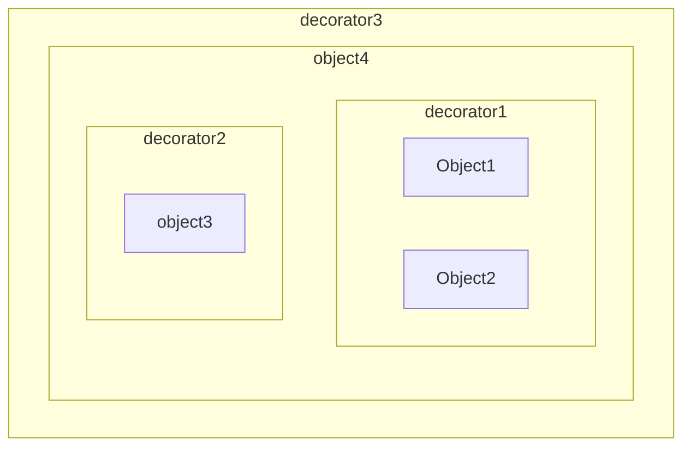
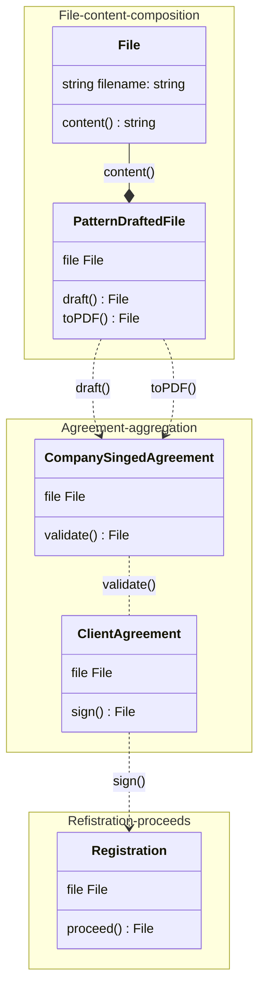

# **Decorators-rus**
<span class='translation_button'>[Читать на англ.](/Programming/Decorators and composition)</span>

<link href="/stylesheets/tags.css" rel="stylesheet" type="text/css"/>
<div class="tags">
    <div class='tag'>
        <a href="/tags#Programming">Программирование</a>
    </div>
    <div class='tag'>
        <a href="/tags#Typescript">TypeScript</a>
    </div>
    <div class='tag'>
        <a href="/tags#OOP">ООП</a>
    </div>
</div>
*23.09.2023* | *6-7 мин. чтения*  
*Дальнейшие примеры представлены на TypeScript, скомпилированы и запущены с использованием ts-node*

---
## Введение

Согласно [wikipedia](https://en.wikipedia.org/wiki/Decorator_pattern), шаблон декоратор - это своего рода объект-обертка вокруг исходного (целевого) объекта, которая каким-то образом расширяет его **поведение**.  
В программировании это, вероятно, самый широко используемый шаблон проектирования, в частности в объектно-ориентированном программировании.

*Важное замечание*  
Декоратор всегда должен реализовывать исходный интерфейс и восприниматься клиентом, использующим его, как оригинальный декорируемый объект. Поэтому не может быть никаких дополнительных методов, поведения или переопределения существующих.

## Детали

Давайте утверждать, почему это хорошо и какие в этом преимущества:
- Он следует основному принципу в подлинном ООП - объединяет (оборачивает) меньшие объекты в больший. И поскольку объект должен скрывать данные и предоставлять поведение, декоратор **инкапсулирует это поведение** и добавляет к нему еще, что не входило в обязанности исходного объекта с самого начала.

- Декоратор позволяет сохранить контроль над объектом.  
    Когда объект декорирован, и если он мал и понятен, композиция с декоратором при обертывании позволяет программисту легко контролировать добавление поведения (см. эту статью).  
    На практике это означает, когда вы пишете декоратор для объекта, он все еще остается вашим кодом и вашим объектом, вы сохраняете контроль над ним.
  
- Это дает вам отличный инструмент для определения **распределения по назначению**.  
    Например, если у вас есть объект *File*, декорируя его для различных сценариев использования, он может быть:
        1. *CachedFile* - оригинальный файл декорирован слоем кэша, который позволяет прочитать файл впервые и затем дает вам кэшированное содержимое, пока содержимое файла не изменится.
        2. *LicensedFile* - например, когда вы читаете файл, вносите в него изменения или хотите добавить только лицензию для последующего его использования, вы можете создать декоратор для записи лицензии и использовать его по мере необходимости.
        3. *GrammarCheckedFile* - если вы проверяете грамматику файла, содержащего человеческий язык, и хотите передать его дальше, вы можете расширить поведение оригинального файла декоратором проверки грамматики, который вернет оригинальный файл и отчет о проверке с ошибками, предупреждениями…

С учетом вышесказанного мы представляем нашу модель объекта вот так:


Таким образом, когда происходит композиция, и, как мы знаем, это лучшее решение для создания чистой ОО архитектуры, легкой для поддержки, тестирования, исправления, расширения и модификации.

---
## На практике
### Пример 1
Давайте быстро ознакомимся с программированием.
У нас есть файл *sample.txt* со следующим содержимым:
```
This is some content
```
И мы написали *File.ts*:
```typescript
import { readFileSync } from 'fs';
import { join } from 'path';

export interface IFile {
    content: () => string;
}

export class File implements IFile {
    public filename: string;
    constructor (filename: string) {
        this.filename = filename;
    }
    content() {
        try {
            return readFileSync(join(__dirname, this.filename), 'utf-8');
        } catch (e) {
            throw new Error('Could not read the file');
        }
    }
}

console.log(
    new File('./sample.txt').content()
    );
```
Результат, который у нас есть:
```
This is some content
```

Теперь мы хотим иметь кэшированный файл, который позволял бы нам получить содержимое, не обращаясь каждый раз к оригинальному файлу и фактически не читая его, мы можем использовать декоратор *CachedFile.ts*:
```typescript
import { IFile, File } from "./File";

interface ICachedFile {
    content: () => string;
}

class CachedFile implements ICachedFile {
    public file: IFile;
    public cachedContent: string;
    constructor (file: IFile) {
        this.file = file;
        this.cachedContent = file.content();
    }
    content() {
        if (this.cachedContent) {
            return this.cachedContent;
        }
        const fileContent = this.file.content();
        console.log('call original file:\n')
        return fileContent;
    }
}

const cachedFile = new CachedFile(
    new File('./sample.txt')
);
console.log(cachedFile.content(), '\n\nПервый вызов\n')
console.log(cachedFile.content(), '\n\nВторой вызов\n')
console.log(cachedFile.content(), '\n\nТретий вызов\n')

```
И теперь у нас это:
```
call original file

This is some content

Первый вызов

This is some content

Второй вызов

This is some content

Третий вызов
```
*Как видим, `call original file` выводится только один раз, что означает, что другие содержимые были из кэша*

### Пример 2
И последний пример - *LicensedFile*, этот короче и понять его назначение, я думаю, легко:
```typescript
import { IFile, File } from "./File";

interface ILicensedFile {
    content: () => string;
}

class LicensedFile implements ILicensedFile {
    public file: IFile;
    constructor (file: IFile) {
        this.file = file;
    }
    content() {
        const fileContent = this.file.content();
        return `LICENSED with ABC…\n---\n${fileContent}`;
    }
}

const licensedFile = new LicensedFile(
    new File('./sample.txt')
);
console.log(licensedFile.content())
```
Результат:
```
LICENSED with ABC…
---
This is some content
```

Мы также можем сочетать их вместе:
```typescript
const licensedFile = new CachedFile (
	new LicensedFile(
		new File('./sample.txt'
	)
));
```
---
## Заключение

Как мы видим, декораторы позволяют нам составлять объекты,
смотреть на поток управления,
разделять обязанности для объекта специфической доменной модели различного поведения,
преобразовывать представление исходного объекта наружу путем добавления нового слоя интерфейса, не вникая в него и не изменяя его, следовать правилу: *"низкая связность, высокая связность"*

Таким образом, когда основной объект должен быть объединен с некоторым новым поведением, вещи, которые нам нужно помнить - не открывайте просто данные, не пишите все больше и больше методов, не связанных с прямой ответственностью объекта. Это означает, что мы можем и должны составлять все большие и большие объекты с помощью декораторов, новых объектов, некоторых новых декораторов…

В конце концов, некоторая программа может выглядеть так, и я думаю, что это замечательный контент для отображения и поддержки:
*Пример регистрации и подписания соглашения между компанией и клиентом*
```
new Registration(
	new ClientAgreement(
		new CompanySignedAgreement(
			new PatternDraftedFile(
				new File('UserAgreementData.xml')
			).draft()
            .toPDF()
		).validate()
	).sign()
).proceed()
```

<a href="https://creately.com/guides/class-diagram-relationships/" target="_blank">UML дизайн<a>:  


